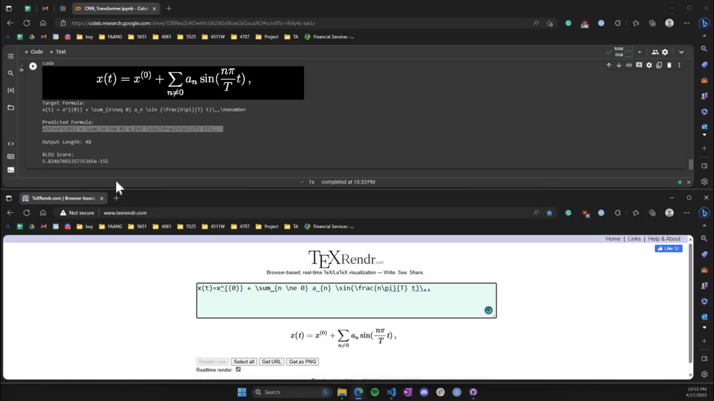

# Image2LaTeX: Mathematical Formula Recognition

This project explores the application of deep learning for converting images of mathematical formulas into LaTeX markup. It combines a **ResNet encoder** with a **Transformer decoder** to effectively translate complex formula structures from raw image input to well-structured LaTeX output.

## Objective

LaTeX is the gold standard for writing mathematical content, but it’s tedious to write by hand—especially from images or textbooks. Our model automates this process, making mathematical communication more efficient and accessible.

## How It Works

- **Encoder**: A ResNet-50 extracts spatial and structural features from an image of a formula.
- **Decoder**: A Transformer model generates LaTeX code using multi-head attention and positional embeddings.
- **Training Dataset**: im2latex-100k dataset from the KDD Cup (Deng et al. 2016), containing 100k+ formula-image pairs.

## Results

Achieved a BLEU score of **0.7745** on the original dataset, and **0.8786** on the whitespace-normalized version. When accounting for dataset inconsistencies—such as different LaTeX expressions that render the same output—the score further improves to **0.945**.

## Demo Video

The video showcases the model translating images to LaTeX in real time.

## Project Report

For an in-depth look at our model architecture, training process, challenges, and evaluation:

 **[Read the full project report (PDF)](./docs/image2latex.pdf)**  
It covers everything from data preprocessing to BLEU score interpretation, with examples and visualizations.
